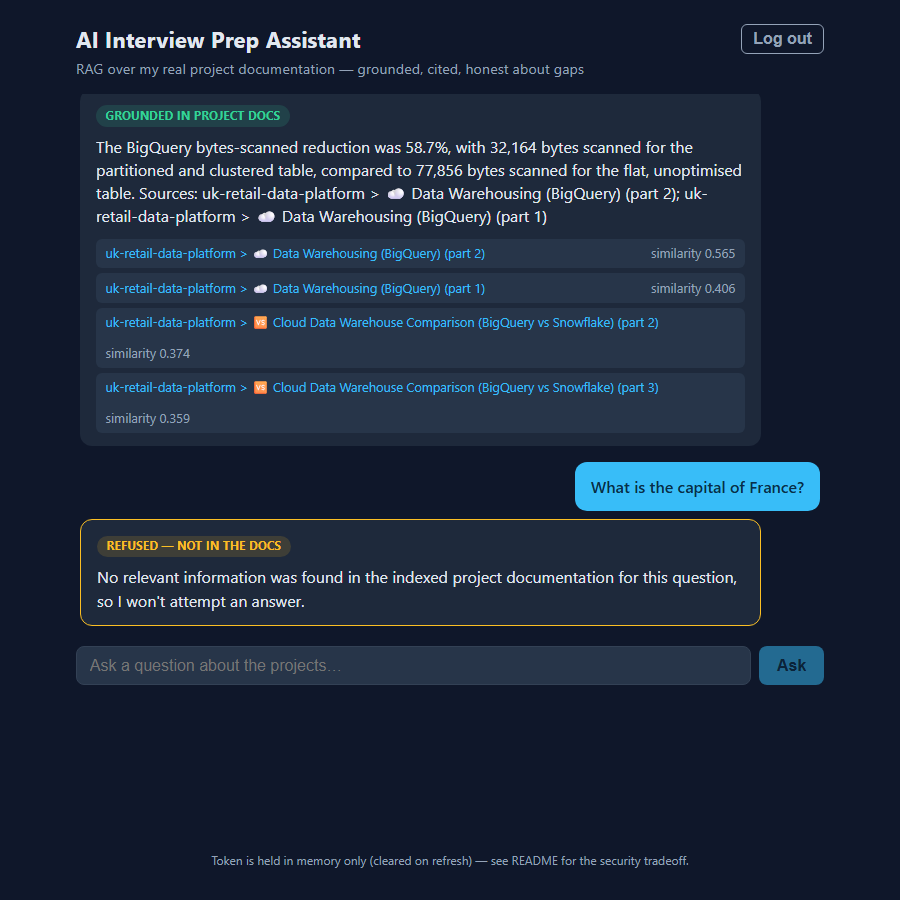

# AI Interview Prep Assistant — RAG Backend + API

Ask natural-language questions about my portfolio projects and get answers
grounded in — and cited against — their real README documentation.

**Phase 1:** a working, tested, evaluated RAG backend (below).
**Phase 2:** a JWT-protected FastAPI layer wrapping it (see [API Layer](#api-layer)).
**Phase 3:** a React frontend, Docker Compose stack, and deployment
(see [Frontend](#frontend), [Running the Full Stack](#running-the-full-stack-docker-compose),
[Deployment](#deployment)).

**Live demo:** https://interview-prep-frontend-xwk1.onrender.com
(free tier — the backend sleeps when idle, so the first request after a
break can take a minute to wake it).

Knowledge base (in `docs/`, pulled from the real GitHub repos):

- [uk-crime-data-pipeline](https://github.com/syedahmadbokhari/UK-Crime-Data-Pipeline)
- [uk-retail-data-platform](https://github.com/syedahmadbokhari/uk-retail-data-platform)

---

## Architecture

```
docs/*.md ──► chunking ──► embedding ──► FAISS index
(READMEs)     (by markdown  (all-MiniLM-   (IndexFlatIP,
               section)      L6-v2, local)  exact cosine)
                                               │
question ──► embed query ──► top-k search ─────┤
                                               ▼
                              relevance gate (cosine ≥ 0.30)
                               │ below threshold        │ above
                               ▼                        ▼
                     honest "nothing found"     Groq LLM (llama-3.3-70b)
                     answer, no LLM call        answers ONLY from chunks,
                                                cites project > section
```

| Stage | File | Choice |
|---|---|---|
| Ingestion/chunking | `rag/chunking.py` | Markdown-section chunks, paragraph sub-split > 350 words with 1-paragraph overlap |
| Embeddings | `rag/embeddings.py` | `sentence-transformers/all-MiniLM-L6-v2` (local, free) |
| Vector store | `rag/vector_store.py` | FAISS `IndexFlatIP` over L2-normalized vectors (= exact cosine) |
| Generation | `rag/generation.py` | Groq free tier, `llama-3.3-70b-versatile`, temperature 0 |
| Orchestration | `rag/pipeline.py` | Retrieve → threshold gate → generate, with citations |

## Design decisions and why

**Chunking — by markdown section, not fixed token windows.** READMEs are
deliberately structured; a section like "Data Warehousing (BigQuery)" is a
coherent unit whose table and explanatory prose belong together. Fixed-size
windows routinely cut a figure (58.7%) away from the sentence that says what
it measures, which directly hurts grounding. Section headings also give
citation metadata for free (`project > section`). Sections longer than 350
words are sub-split at paragraph boundaries (never inside a code fence) with
one paragraph of overlap so boundary facts land in both pieces. The two
READMEs produce **70 chunks** (23 crime, 47 retail).

**Embedding model — all-MiniLM-L6-v2.** 22M params, ~90MB, 384-dim, runs on
CPU in well under a second for this corpus. It sits near the top of the
speed/quality frontier for short-passage retrieval; bigger models
(all-mpnet-base-v2, bge-base) score a few benchmark points higher at 3–5×
the cost, which buys nothing at 70 chunks where chunking quality dominates.
Free and fully local — no API key for ingestion or retrieval.

**FAISS IndexFlatIP.** Exact search: at this scale ANN indexes (IVF/HNSW)
add complexity and recall loss for zero speed benefit. Normalized vectors
make inner product equal cosine similarity, so scores are directly
comparable to the relevance threshold.

**No-result handling — a threshold gate before the LLM, not just a prompt
rule.** If no chunk reaches cosine 0.30, the pipeline returns an explicit
"no relevant information found" without calling the LLM at all, so an
off-topic question never gets a fluent ungrounded answer. The threshold is
measured, not guessed: on this corpus the 10 on-topic eval questions scored
**0.469–0.722** against their best chunk; off-topic controls ("capital of
France?", cookie recipe) peaked at **0.161**. The prompt additionally
instructs refusal when context is insufficient — defense in depth.

**Generation — Groq free tier.** Chosen by the project owner over local
Ollama. `llama-3.3-70b-versatile` at temperature 0, with a system prompt that
restricts answers to the supplied excerpts, requires exact figures, and ends
every answer with a `Sources:` line naming the citations used.

## Setup

```powershell
# Python 3.11 venv (faiss-cpu/torch wheels; 3.14 not yet supported)
py -3.11 -m venv .venv
.venv\Scripts\pip install -r requirements.txt

# Groq key (free at console.groq.com) — either env var or .env file:
#   .env:  GROQ_API_KEY=gsk_...
```

## Usage

```powershell
# 1. Build the index from docs/*.md  (one-time; re-run when docs change)
.venv\Scripts\python ingest.py

# 2. Ask questions
.venv\Scripts\python ask.py "What was the BigQuery bytes-scanned reduction?"
.venv\Scripts\python ask.py --retrieval-only "kafka kraft"   # no LLM call

# 3. Run the evaluation
.venv\Scripts\python -m evaluation.run_eval                  # full (needs key)
.venv\Scripts\python -m evaluation.run_eval --retrieval-only # no key needed

# 4. Run tests (no network, no API key, no model download needed)
.venv\Scripts\python -m pytest tests/ -v
```

## Evaluation — real results (run 2026-07-23)

12 cases in `evaluation/eval_set.json`: 10 grounded questions whose expected
answers are verbatim facts from the READMEs, plus 2 off-topic controls.
Full raw output in `evaluation/results.json`.

| Metric | Result |
|---|---|
| Retrieval accuracy (expected fact present in retrieved chunks, right project) | **10/10** |
| Answer faithfulness (generated answer states the documented fact) | **10/10** |
| Honest refusals on off-topic questions | **2/2** (LLM never called) |

Sample: *"What was the BigQuery bytes-scanned reduction achieved by
partitioning and clustering?"* → retrieved `uk-retail-data-platform > Data
Warehousing (BigQuery) (part 2)` at 0.539 → *"...was 58.7%..."* — matching
the documented figure (32,164 vs 77,856 bytes).

**Honest observations from the run (not failures, but worth knowing):**

- The Optuna-clusters question retrieved only **one** chunk above the
  threshold (0.469) — the right one, but the thinnest margin in the set.
  Questions phrased very differently from the source text are the likeliest
  future retrieval misses.
- For two questions the *top-ranked* chunk was not the ideal section (e.g.
  the DuckDB question ranked "Data Source" above "Architecture"), but the
  correct section was still inside top-4, so answers stayed grounded. With
  `top_k` = 1–2 instead of 4, at least one of these would likely have missed.
- Faithfulness is keyword-checked (documented figure appears in the answer)
  plus refusal-checked; it is not a full LLM-judged entailment eval. At this
  eval size, spot-reading `evaluation/results.json` covers the gap.

## API Layer

Phase 2 wraps the Phase 1 pipeline in a FastAPI app ([api/main.py](api/main.py)).
It is a deliberately thin wrapper: `/ask` calls the same `RAGPipeline.ask()`
the CLI uses, so retrieval, grounding, and the similarity-gated refusal path
are byte-for-byte the Phase 1 behavior — the refusal gate runs *inside*
`ask()` and cannot be bypassed from the API layer.

| Endpoint | Auth | Purpose |
|---|---|---|
| `GET /health` | none | liveness check |
| `POST /auth/login` | username + password | returns a JWT bearer token |
| `POST /ask` | `Authorization: Bearer <jwt>` | question → grounded answer + cited sources + similarity scores |

### Running it

```powershell
.venv\Scripts\python -m uvicorn api.main:app --port 8000
# interactive docs at http://127.0.0.1:8000/docs
```

Configuration lives in the gitignored `.env` (see [.env.example](.env.example)):
`JWT_SECRET_KEY`, `API_USERNAME`, `API_PASSWORD_HASH` (bcrypt hash — the
plaintext password is stored nowhere), plus optional `JWT_EXPIRY_MINUTES`
(default 45) and `RATE_LIMIT` (default `10/minute`).

### Calling it (real example)

```bash
# 1. Log in
curl -s -X POST http://127.0.0.1:8000/auth/login \
  -H "Content-Type: application/json" \
  -d '{"username":"ahmad","password":"<your-password>"}'
# -> {"access_token":"eyJ...","token_type":"bearer","expires_in_minutes":45}

# 2. Ask
curl -s -X POST http://127.0.0.1:8000/ask \
  -H "Authorization: Bearer eyJ..." \
  -H "Content-Type: application/json" \
  -d '{"question":"What was the BigQuery bytes-scanned reduction?"}'
# -> {"question":"...","answer":"The BigQuery bytes-scanned reduction was
#     58.7%. Sources: uk-retail-data-platform > Data Warehousing (BigQuery)
#     (part 2); ...","grounded":true,"sources":[{"citation":"uk-retail-data-
#     platform > ☁️ Data Warehousing (BigQuery) (part 2)","score":0.565},...]}
```

Off-topic questions return `"grounded": false` with the honest no-result
answer and an empty `sources` list — verified live.

### Design choices, honestly stated

**JWT (PyJWT, HS256), 45-minute expiry.** Long enough for a full
interview-prep session without re-login, short enough that a leaked token
has a tightly bounded life. No refresh-token flow — for a single-user local
API that complexity buys nothing; you log in again. Missing, malformed,
expired, and wrongly-signed tokens all return proper `401`s with
`WWW-Authenticate: Bearer`.

**Password stored as a bcrypt hash even for one user.** `.env` files leak —
backups, screen shares, accidental commits — and a leaked *hash* doesn't
reveal the password. bcrypt is used directly rather than via passlib, which
is unmaintained and breaks against bcrypt ≥ 4.1. Login returns the same
error for wrong-user and wrong-password (no username enumeration).

**Rate limiting: slowapi, in-memory, 10/minute on `/ask`, keyed by client
IP.** Each `/ask` costs one Groq free-tier request (~30/min allowed), so
10/min keeps one chatty client from exhausting the quota. Known limitations,
stated plainly: counters live in process memory — they reset on restart and
are **not** shared across multiple uvicorn workers or scaled instances; IP
keying misattributes clients behind a shared NAT/proxy. A production
deployment would back slowapi with Redis and trust `X-Forwarded-For` only
from a known proxy. Fine for a single-process personal API.

**Error contract** — the client never sees a stack trace: `422` invalid
body, `401` auth failures, `429` rate-limited, `502` pipeline/Groq failure
(full traceback goes to the server log only), `503` index not built yet.

## Frontend

A minimal Vite + React chat UI ([frontend/](frontend/)) over the API: log
in, ask questions, read grounded answers with their cited sources and
similarity scores displayed inline — and see refusals clearly flagged
(amber "Refused — not in the docs" badge) instead of dressed up as answers.



### Running it in development

```powershell
# terminal 1 — backend
.venv\Scripts\python -m uvicorn api.main:app --port 8000
# terminal 2 — frontend (http://localhost:5173)
cd frontend; npm install; npm run dev
```

The dev server proxies `/api/*` to the backend (see
[frontend/vite.config.js](frontend/vite.config.js)), so the app is
same-origin and the Phase 2 API needed **zero** CORS changes. The base URL
is configurable via `VITE_API_BASE_URL` for split hosting.

### Security tradeoff, stated honestly

The JWT lives **only in React state** — never localStorage/sessionStorage,
which any XSS-injected script can read. The cost of in-memory storage: a
page refresh drops the token and you sign in again. For a single-user tool
with 45-minute tokens that's an acceptable tradeoff; the "proper" fix
(httpOnly cookie sessions with CSRF protection) is deliberately out of
scope and noted here rather than pretended away.

### How it was verified — a real round-trip, not a visual check

[frontend/e2e-check.mjs](frontend/e2e-check.mjs) drives the actual UI in
headless Chromium against the actually-running backend: fills the login
form, submits a real question, waits for the live Groq-generated answer,
asserts it contains the documented 58.7% figure and that sources are
rendered, then asserts the off-topic control shows the refusal badge.
Output from the real run:

```
LOGIN: ok (chat visible)
ANSWER: The BigQuery bytes-scanned reduction was 58.7%, with 32,164 bytes scanned...
BADGE: Grounded in project docs
SOURCES: uk-retail-data-platform > ☁️ Data Warehousing (BigQuery) (part 2) | ...
REFUSAL BADGE: Refused — not in the docs
E2E PASS — real UI round-trip verified
```

The screenshots above were captured by that run. It needs both servers and
a live Groq call, so it's a manual script, not part of the pytest suite.

## Running the Full Stack (Docker Compose)

```powershell
docker compose up --build
# UI:  http://localhost:8080
# API: reachable only through the frontend's /api/* proxy (not published)
```

- **Backend image** ([Dockerfile](Dockerfile)): python:3.11-slim; the FAISS
  index AND the embedding model download are baked in at build time
  (`RUN python ingest.py`), so the container serves immediately with no
  runtime dependency on huggingface.co. Honest note: torch makes the image
  ~2 GB.
- **Frontend image** ([frontend/Dockerfile](frontend/Dockerfile)):
  multi-stage — Node builds the static assets, nginx serves them and
  proxies `/api/*` to the `api` service (same-origin, mirroring dev).
- **Secrets**: injected at runtime from the gitignored `.env` via
  `env_file`; [.dockerignore](.dockerignore) excludes `.env` from the build
  context so nothing secret is ever baked into an image layer.
- The frontend waits on the API's `/health` healthcheck before starting.

## Deployment

**Status: LIVE** (deployed 2026-07-26 via the Render blueprint below).
Frontend: https://interview-prep-frontend-xwk1.onrender.com · API:
https://interview-prep-api-3msj.onrender.com (JWT-protected; only /health
is public). Verified post-deploy with the same Playwright round-trip used
locally: real login, the BigQuery question answered with the documented
58.7% figure and cited sources, off-topic question refused. The 512 MB
free-instance RAM risk flagged below did NOT materialize — the service
builds and serves within the free tier.

**Platform: Render** ([render.yaml](render.yaml)). Rationale (2026):
Render still offers a genuinely free web-service tier (spins down after
~15 min idle) plus free static hosting with rewrite-proxying, no credit
card required — Railway's free tier is now a one-time trial credit, and
Fly.io requires a card for new orgs. Known risk, stated in the blueprint
itself: the free instance has 512 MB RAM and torch + MiniLM wants
~400–600 MB, so the API may OOM on free — the fallbacks are the $7/mo
instance or an ONNX embedder.

Manual steps to go live (nothing below has been executed):

1. Push this repo to GitHub (private is fine — Render reads via OAuth).
2. Create a Render account (free), choose **New → Blueprint**, point it at
   the repo; `render.yaml` defines both services.
3. In the Render dashboard, set the secret env vars it will prompt for:
   `GROQ_API_KEY`, `API_USERNAME`, `API_PASSWORD_HASH` (generate the bcrypt
   hash locally — command in [.env.example](.env.example)).
   `JWT_SECRET_KEY` is auto-generated by Render per the blueprint.
4. After the first deploy, confirm the frontend's `/api/*` rewrite in
   `render.yaml` matches the API service's actual `.onrender.com` hostname;
   adjust and redeploy if Render assigned a different name.
5. Verify: open the static site URL, log in, ask the BigQuery question,
   and check an off-topic question still gets refused.

## Tests — 31 passing (17 Phase 1 + 14 API)

API tests ([tests/test_api.py](tests/test_api.py)) run against a
`FakePipeline` injected via FastAPI dependency override — no Groq calls, no
embeddings, no FAISS. They cover: login issues a decodable token; wrong
password / unknown user get identical 401s; `/ask` without, with malformed,
with expired, and with wrongly-signed tokens → 401; valid token → grounded
answer with citations; the refusal path passes through the wrapper
unchanged; invalid bodies → 422; a pipeline exception → 502 with no
internals leaked; rate limiting returns 429 after the threshold and doesn't
apply to `/health`.

### Phase 1 tests — 17

Chunking, retrieval, and pipeline tests (chunking: section splitting, code-fence
safety, metadata, long-section overlap; retrieval: correct top-k on a fixed
corpus, score ordering, save/load roundtrip, empty store; pipeline: grounded
path with citations, threshold filtering, and the no-result path asserting
the LLM is **never called**). Tests use a deterministic bag-of-words fake
embedder and a spy generator — no network, no API key, no model download.

## Project structure

```
docs/                    # knowledge base: the two real project READMEs
frontend/                # Vite + React chat UI (Dockerfile: build -> nginx)
Dockerfile               # backend image (index + model baked at build)
docker-compose.yml       # full stack: api + frontend
render.yaml              # deployment blueprint (prep only — NOT deployed)
api/
  main.py                # FastAPI app: /health, /auth/login, /ask
  auth.py                # bcrypt password check + PyJWT issue/verify
  schemas.py             # Pydantic request/response models
  settings.py            # .env-backed config (same pattern as Phase 1)
rag/
  chunking.py            # markdown-section chunking + metadata
  embeddings.py          # all-MiniLM-L6-v2 wrapper (Embedder protocol)
  vector_store.py        # FAISS store: add / search / save / load
  generation.py          # Groq generator with grounding prompt
  pipeline.py            # retrieve → threshold gate → generate
ingest.py                # CLI: build index/ from docs/
ask.py                   # CLI: ask a question (or --retrieval-only)
evaluation/
  eval_set.json          # 12 cases grounded in real README facts
  run_eval.py            # retrieval accuracy + answer faithfulness report
  results.json           # raw output of the latest real run
tests/                   # 17 pytest tests, fully offline
```
