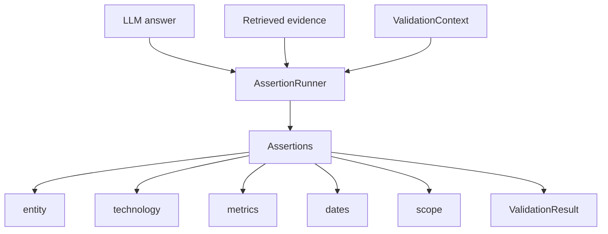

# rag-assertions

Deterministic post-generation validation for grounded LLM and RAG outputs.

**Distribution:** `rag-assertions`
**Import:** `rag_assertions`
**Version:** `0.1.0`
**Package name availability:** PACKAGE NAME AVAILABILITY NOT VERIFIED

## What It Is

`rag-assertions` is a small, provider-agnostic Python library for checking
whether generated answers stay grounded in supplied evidence. It accepts plain
Python strings and evidence objects, runs deterministic validators, and returns
typed results that applications can log, display, use for retries, or use for
safe refusal decisions.

## Why

RAG retrieval does not guarantee that a generated answer remains faithful to
the retrieved evidence. This library explores cheap deterministic checks for
common grounding failures before an answer is returned.

The built-in assertions do not call external LLMs and do not depend on
Anthropic, OpenAI, Groq, LangChain, LangGraph, LlamaIndex, or any RAG framework.

## Installation

Future published usage, after manual publication:

```bash
pip install rag-assertions
```

Local monorepo development:

```bash
cd packages/rag_assertions
pip install -e .[dev]
```

## Quick Start

```python
from rag_assertions import AssertionRunner, EvidenceItem, ValidationContext

evidence = [
    EvidenceItem(
        text="Product Alpha achieved 94% accuracy using DuckDB.",
        source="alpha.md",
        entity="Product Alpha",
    )
]

runner = AssertionRunner()
result = runner.validate(
    answer="Product Alpha achieved 94% accuracy using DuckDB.",
    evidence=evidence,
    context=ValidationContext(known_entities=("Product Alpha",)),
)

print(result.passed)
print([failure.reason for failure in result.failures])
```

## Core Concepts

- `EvidenceItem`: generic retrieved evidence with text, source, optional entity,
  chunk id, score, and serializable metadata.
- `BaseAssertion` / `AssertionProtocol`: interface for deterministic validators.
- `AssertionRunner`: deterministic executor with assertion disabling and typed
  aggregate results.
- `AssertionResult`: result from one assertion, including claim, reason,
  evidence, status, severity, and metadata.
- `ValidationResult`: aggregate pass/fail/skip counts and failures.

## Built-In Assertions

- `EntityExistsAssertion` - stable for 0.1. Checks entity-like claims against a
  caller-provided registry.
- `ProjectExistsAssertion` - stable compatibility wrapper for project-centric
  applications.
- `TechnologyGroundedAssertion` - stable for 0.1. Checks explicit technology/tool
  claims against evidence text.
- `TechStackGroundedAssertion` - stable compatibility name used by the parent
  Interview Prep Assistant.
- `MetricsGroundedAssertion` - stable for 0.1. Checks percentages, decimals,
  integers, scientific notation, and thousands separators against evidence.
- `DateGroundedAssertion` / `NoFabricatedDatesAssertion` - stable for 0.1.
  Checks factual year claims while avoiding common version-number contexts.
- `ScopeBoundedAssertion` - experimental. Uses lexical overlap to flag factual
  claims that appear unsupported by evidence.

## Custom Assertions

```python
from rag_assertions import BaseAssertion

class CitationRequiredAssertion(BaseAssertion):
    name = "citation_required"

    def validate(self, answer, evidence, context):
        if "Sources:" in answer:
            return self.pass_result("Sources line", "Answer includes a Sources line.")
        return self.fail_result("missing Sources line", "Answer did not cite sources.")
```

Register it:

```python
runner = AssertionRunner(assertions=[CitationRequiredAssertion()])
```

## Architecture



The library validates only. Applications own retrieval, generation, retry,
refusal, tracing, and user experience.

## Limitations

- Deterministic matching is practical, not semantic entailment.
- Grounded means supported by supplied evidence, not universally true.
- Supplied evidence may itself be wrong or incomplete.
- Lexical checks can miss paraphrases and can flag valid claims with sparse
  evidence.
- Numeric equivalence is conservative; `0.94` is not automatically treated as
  `94%`.
- Scope validation is experimental and should be human-reviewed before strict
  production gating.

## Development

```bash
python -m pytest
python -m build
python -m twine check dist/*
```

## Research Status

This package was extracted from an Interview Prep Assistant research prototype.
Mock evaluation infrastructure exists, but live ablation evidence is still
pending. Do not treat mock results as empirical model-quality conclusions.
